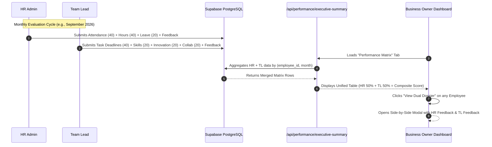

# Performance Evaluation Architecture: Single Table vs Dual Table Design & Real-Time Industry Standard Implementation

---

## 1. Executive Summary & Core Question

### The Questions Asked:
1. **Is it possible to combine HR score/feedback and Manager score/feedback into a single table?**  
   **Answer: YES.** It is completely feasible and widely used under specific workflow paradigms.
2. **Why does creating two tables vs one table work, and what are the trade-offs?**
3. **How do real-world enterprise products (Workday, BambooHR, Lattice, Darwinbox, Zoho People) implement this?**
4. **What is the architectural blueprint for implementing this in our HRMS application?**

---

## 2. Deep Dive: Single Table vs. Two Separate Tables

### Approach A: Single Unified Table (`monthly_employee_appraisals`)

In this design, every employee has exactly **one record per month** containing columns for both HR and Manager inputs.

#### Proposed Table Schema:
```sql
CREATE TABLE monthly_employee_appraisals (
    id UUID PRIMARY KEY DEFAULT gen_random_uuid(),
    employee_id UUID NOT NULL REFERENCES employees(id) ON DELETE CASCADE,
    evaluation_month DATE NOT NULL, -- e.g., '2026-09-01'
    
    -- === 1. HR EVALUATION SECTION ===
    hr_evaluated_by UUID REFERENCES employees(id),
    hr_attendance_score NUMERIC(5,2) DEFAULT 0,    -- Max 40
    hr_working_hours_score NUMERIC(5,2) DEFAULT 0, -- Max 40
    hr_leave_score NUMERIC(5,2) DEFAULT 0,         -- Max 20
    hr_total_score NUMERIC(5,2) DEFAULT 0,         -- Max 100
    hr_feedback TEXT,
    hr_status VARCHAR(20) DEFAULT 'PENDING',       -- 'PENDING', 'SUBMITTED'
    hr_submitted_at TIMESTAMPTZ,
    
    -- === 2. MANAGER / TL EVALUATION SECTION ===
    tl_evaluated_by UUID REFERENCES employees(id),
    tl_task_completion_score NUMERIC(5,2) DEFAULT 0, -- Max 40 (Auto)
    tl_learning_score NUMERIC(5,2) DEFAULT 0,        -- Max 20 (Manual)
    tl_innovation_score NUMERIC(5,2) DEFAULT 0,      -- Max 20 (Manual)
    tl_collaboration_score NUMERIC(5,2) DEFAULT 0,   -- Max 20 (Manual)
    tl_total_score NUMERIC(5,2) DEFAULT 0,           -- Max 100
    tl_feedback TEXT,
    tl_status VARCHAR(20) DEFAULT 'PENDING',         -- 'PENDING', 'SUBMITTED'
    tl_submitted_at TIMESTAMPTZ,
    
    -- === 3. COMPOSITE / EXECUTIVE SECTION ===
    final_composite_score NUMERIC(5,2) GENERATED ALWAYS AS (
        CASE 
            WHEN hr_status = 'SUBMITTED' AND tl_status = 'SUBMITTED' 
            THEN (hr_total_score * 0.50 + tl_total_score * 0.50)
            WHEN hr_status = 'SUBMITTED' THEN hr_total_score
            WHEN tl_status = 'SUBMITTED' THEN tl_total_score
            ELSE 0
        END
    ) STORED,
    overall_status VARCHAR(20) DEFAULT 'IN_PROGRESS', -- 'IN_PROGRESS', 'COMPLETED', 'PUBLISHED'
    
    created_at TIMESTAMPTZ DEFAULT NOW(),
    updated_at TIMESTAMPTZ DEFAULT NOW(),
    
    CONSTRAINT unique_employee_month UNIQUE(employee_id, evaluation_month)
);
```

#### Advantages of Single Table:
* **Zero Joins for Owner Matrix**: Fetching the complete monthly dashboard requires a simple `SELECT * FROM monthly_employee_appraisals WHERE evaluation_month = :month`.
* **Atomic State Tracking**: You can easily query which employees are missing HR vs. TL evaluations in a single query (`WHERE hr_status = 'PENDING' OR tl_status = 'PENDING'`).
* **Built-in Database Integrity**: The `UNIQUE(employee_id, evaluation_month)` constraint strictly guarantees no duplicate evaluation entries.

#### Disadvantages of Single Table:
* **Partial Concurrency / Race Conditions**: If HR and TL save their evaluation forms at the exact same second, parallel SQL `UPDATE` operations must update only their specific columns (using atomic partial updates) to avoid overwriting each other's data.
* **Row-Level Security (RLS) Granularity**: Supabase RLS policies are applied at the row level. Column-level permissions require careful API validation or Postgres view layers.

---

### Approach B: Two Separate Tables (`monthly_employee_evaluations` & `monthly_team_lead_evaluations`)

In this design, HR evaluations live in Table A, and Manager/TL evaluations live in Table B. The Business Owner view performs a `FULL OUTER JOIN` or `LEFT JOIN` on `(employee_id, month)`.

#### Advantages of Two Tables:
* **Strict Separation of Concerns**: HR workflow and Manager workflow are completely decoupled.
* **Independent Lifecycles**: A TL can submit their evaluation without needing an existing row created by HR, and vice-versa.
* **Simple Role-Based Permissions (RLS)**:
  * Table A: writable only by `HR` role.
  * Table B: writable only by `Team Lead` / `Manager` role.
* **No Write Contention**: HR and TL never lock or touch the same row in Postgres.

#### Disadvantages of Two Tables:
* **Query Complexity**: Requires SQL `JOIN` or application-level aggregation (`Promise.all([fetchHR(), fetchTL()])`) to compute the final combined score for the Owner.
* **Orphaned States**: Harder to enforce cross-table status checks (e.g. "Trigger an alert to the Owner only when both tables have records").

---

## 3. Comparison Matrix

| Criteria | Single Table (`appraisals`) | Two Tables (`hr_evals` + `tl_evals`) |
| :--- | :--- | :--- |
| **Query Performance for Owner** | ⚡ Fastest (1 index scan, no joins) | ⚡ Fast (1 index join on `employee_id, month`) |
| **Data Integrity & Uniqueness** | Strict 1-to-1 enforcement | Requires uniqueness on both tables independently |
| **Concurrent Writes (HR + TL)** | Handled via partial `UPDATE col = val` | Handled natively (separate rows in separate tables) |
| **Permission / RLS Simplicity** | Requires API-level field filtering | Clean table-level RLS policies |
| **Scalability (Adding Peer/Self)**| Requires adding more columns to table | Requires adding 1 more table or polymorphic table |
| **Reporting & Exporting** | 1-click simple export | Requires merged view or SQL JOIN |

---

## 4. How Real-World Enterprise Products Implement This

Enterprise HRMS suites (e.g., **Workday HCM**, **Lattice**, **BambooHR**, **Darwinbox**, **Zoho People**) implement performance appraisal using one of two battle-tested industry architectures:

### Industry Pattern 1: The Unified Cycle Record with Section Blocks (Single/Header-Line Pattern)
* Used by: **Workday**, **Darwinbox**, **Zoho People**
* **Mechanism**: When a monthly cycle opens, the system creates a master appraisal record for each employee (`cycle_instance_id`, `employee_id`).
* This master record holds distinct JSON or column sections:
  * `section_discipline` (HR Attendance, Hours, Policy compliance)
  * `section_deliverables` (Manager/TL Milestones, Quality, Soft Skills)
  * `section_calibration` (Executive/Business Owner Final Decision & Weightage)
* Each stakeholder submits their section independently. The record automatically transitions from `DRAFT` $\to$ `TL_SUBMITTED` $\to$ `HR_SUBMITTED` $\to$ `READY_FOR_CALIBRATION` $\to$ `PUBLISHED`.

### Industry Pattern 2: The Multi-Rater Normalized Appraisal Engine (Polymorphic Table)
* Used by: **Lattice**, **Culture Amp**, **15Five** (360 Feedback Systems)
* **Mechanism**: A single generic table `evaluation_submissions`:
  ```sql
  (id, cycle_id, employee_id, evaluator_id, evaluator_role, scores_json, feedback_text, submitted_at)
  ```
  Where `evaluator_role` can be `'HR'`, `'MANAGER'`, `'PEER'`, or `'SELF'`.
* A database view or aggregation service pivots the roles into a single executive dashboard.

---

## 5. Implementation in Our Current HRMS System

### Formula & Weightage Distribution
$$\text{Overall Executive Score (0–100)} = (\text{HR Score} \times 0.50) + (\text{TL Score} \times 0.50)$$

#### 1. HR Evaluation (Discipline & Compliance - 50% Weight)
* **Attendance Score (Max 40 pts)**: Formula based on Present Days vs Total Working Days.
* **Working Hours Score (Max 40 pts)**: Formula based on Total Logged Hours vs Target Hours (e.g. 8h/day).
* **Leave Adherence Score (Max 20 pts)**: Unapproved / Casual Leave compliance.
* **HR Qualitative Feedback**: Notes on office etiquette, punctuality, and workplace policy compliance.

#### 2. Team Lead / Manager Evaluation (Output & Innovation - 50% Weight)
* **Task Deadline Completion (Max 40 pts - Automated)**: Formula: $(\frac{\text{Completed On-Time Tasks}}{\text{Total Assigned Tasks}}) \times 40$.
* **Learning & Upskilling (Max 20 pts - Manual)**: Rate adaptation to new tech stacks and internal training.
* **Innovation & Problem Solving (Max 20 pts - Manual)**: Solutions provided, code quality, architectural initiative.
* **Team Collaboration (Max 20 pts - Manual)**: PR reviews, cross-team assistance, communication.
* **TL Qualitative Feedback**: Technical review, project impact, growth areas.

---

## 6. Real-Time Process Flow for Business Owner



---

## 7. Recommended Action Plan for Our Codebase

### Decision Verdict:
We already built the high-performance aggregator endpoint:
[`/api/performance/executive-summary/route.js`](file:///c:/HRMS/my-project/app/api/performance/executive-summary/route.js)

This API seamlessly aggregates HR evaluations (`monthly_employee_evaluations`) and TL evaluations (`monthly_team_lead_evaluations`) with zero migration downtime, computing the composite 50/50 score on-the-fly.

### Next Steps to Render this in the Business Owner Dashboard:
1. **Create the Executive Component**: `app/dashboard/components/ExecutivePerformanceMatrix.jsx`
   * Shows a comprehensive table with Employee Name, Department, HR Score (0-100), TL Score (0-100), Final Combined Score (0-100), Performance Badge, and Status.
   * Includes a **"Dual Dossier" Modal / Drawer** displaying HR Feedback and TL Feedback side-by-side.
2. **Mount in Owner Dashboard**: Integrate into [`app/dashboard/components/OwnerDashboard.jsx`](file:///c:/HRMS/my-project/app/dashboard/components/OwnerDashboard.jsx) under a new **"Performance Matrix"** navigation tab.
3. **Add Filter Controls**: Month selector, Department filter, and Excel/CSV export for executive review.
